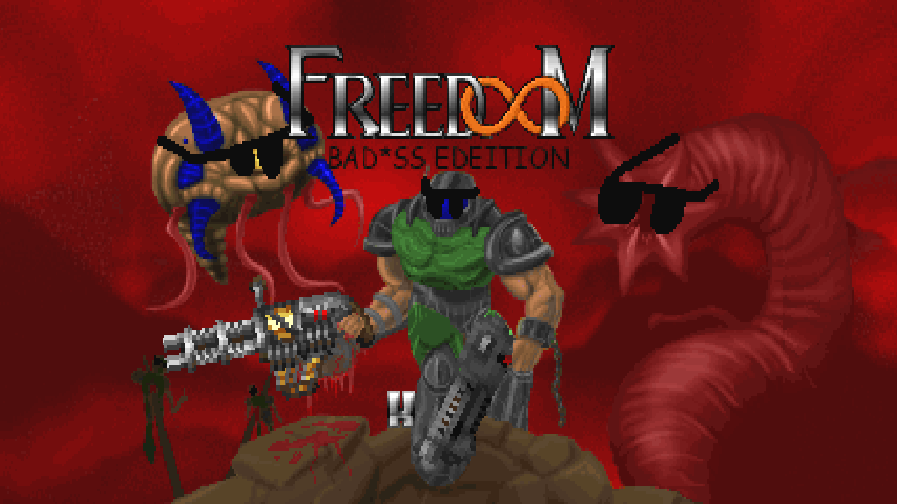
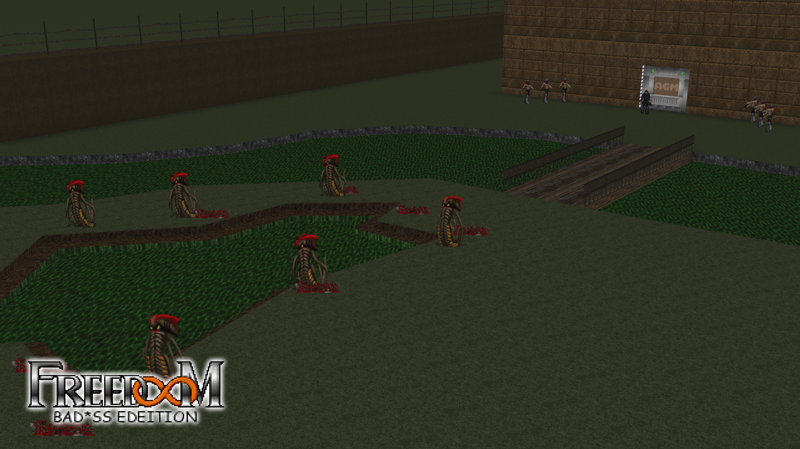
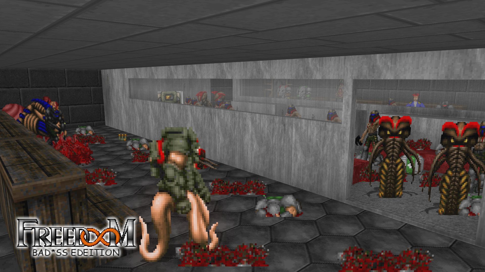
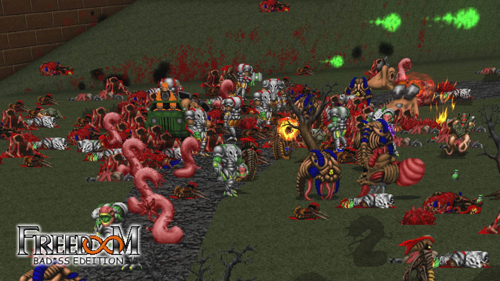
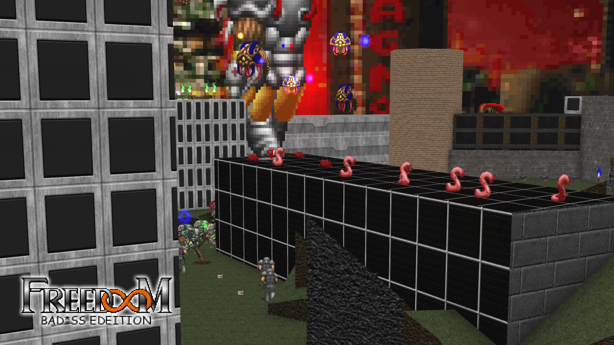
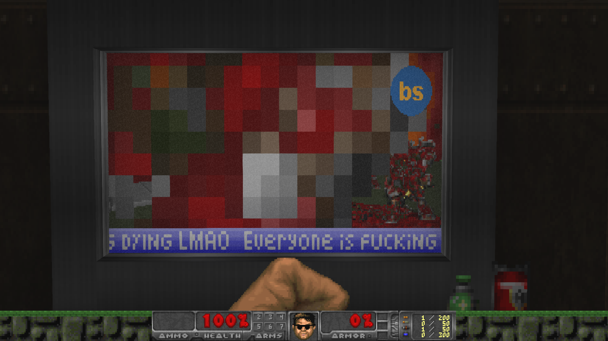
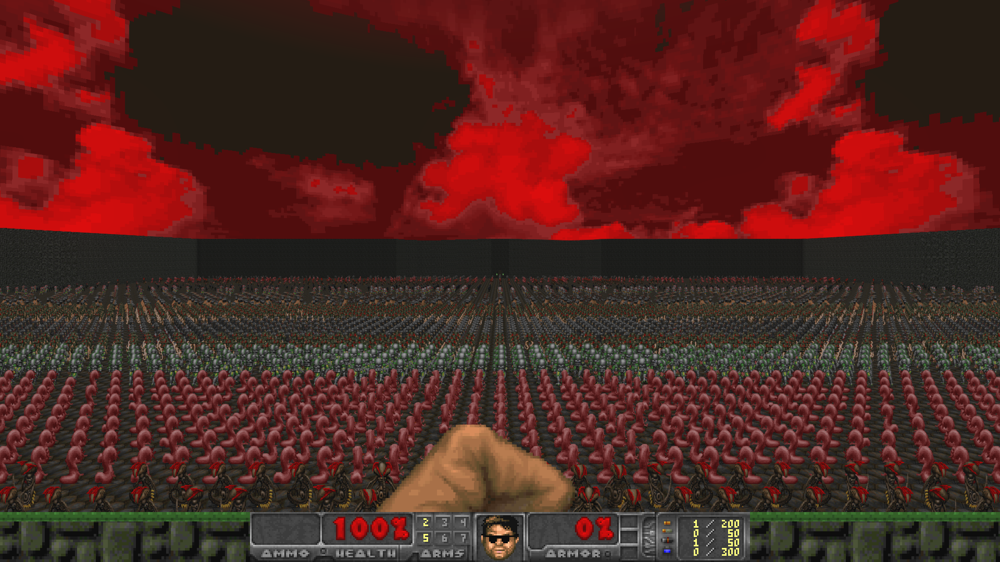

# 

the most bad*ss freedoom mod on earth

wide arsenal of bad*ss weapons

20 new bad*ss community made maps

made for gzdoom/lzdoom and freedoom phase 2

 [official discord](https://discord.gg/wsBdTfru9z)

 [official website](https://freedoom-badass-edition.github.io/)

## screenshots

## installing and launching the mod

### prerequisites

- functioning brain
- a pulse
- a device that runs your desired and supported sourceport
- any supported sourceport (see "sourceport compatibility")
- freedoom phase 2 iwad
- git for the turbo nerd way

### instructions

#### the stable way

1. click on releases

2. click freedoom-badass-edition.pk3

3. drag and drop the downloaded file into your sourceport of choice

4. enjoy (optional)

if you want the newest and most extreme experience you can try the other methods below
#### the nice and quick way

1. click on code > download zip

2. click download zip

3. drag and drop the downloaded file into your sourceport of choice

4. enjoy (optional)

#### the turbo nerd way

1. open your terminal of choice

2. write `git clone https://github.com/freedoom-badass-edition/freedoom-badass-edition.git` and press enter

3. type in the name of the executable of your sourceport and `freedoom-badass-edition` following it (`gzdoom freedoom-badass-edition` for example)

4. enjoy (optional)

# faq

#### is zandronum going to be supported?

no, but you still can play bad*ss deathmatch on your local network using gzdoom or lzdoom (check the question right below this)

#### how do I play multiplayer?

https://zdoom.org/wiki/Multiplayer for the basic stuff

if you need any help or want to find someone willing to play you can check out our [discord](https://discord.gg/wsBdTfru9z)

#### update when?

when anyone in the team feels like doing so, or you can update it yourself if you have the proper skills and making a pull request

#### what should I do if I spot an unusual and possibly game breaking bug, or just want you guys to add something?

you can just send an issue to our github page

#### can I play on other iwads?

the generally recommended experience is playing the mod through freedoom phase 2

phase 1 and the doom iwads work mostly fine, but you won't get the fullest and nicest experience (after all, it's **freedoom** bad*ss edition)

other iwads like strife, hexen, heretic and more are not guaranteed to work and you will definitely not have a good experience

#### i would like to contribute to the project pretty please

go right ahead, you can also join our [discord](https://discord.gg/wsBdTfru9z) if you want to get in contact with the rest of the team

if you want to contribute to the mappack, check the CREDITS file included for any open map slots

#### i have no money for freedoom

what

#### this is too bad*ss for me

too bad

# sourceport compatibility

* gzdoom v4.13.2: perfect
* gzdoom v4.14.0: perfect
* gzdoom v4.14.1: perfect
* gzdoom v4.14.2: perfect
* lzdoom v3.88a: perfect
* qzdoom: untested but might work
* gztoasterdoom: barely works
* zandronum: doesn't work
* zdoom v2.8.1: doesn't work
* anything non-gzdoom/lzdoom based: doesn't work

# quotes

> "Fuck this I'm making a  weapon pack for freedoom on my dead gpu for no particular reason" - Saver310

> "Oops I accidentally created freedoom badass edition" - Saver310

> "Gapisz mi się na bebech?" - Saver310

> "What the fuck is even going on" - Saver310

> "What the fuck is happening" - Saver310

> "I think I'm gonna cave in my skull with a coconut and fall asleep due to head trauma" - Saver310

> "Please for fucks sake somebody update the mod" - Saver310

> "we're so back I inserted 5 words into readme" - Saver310

> "WHITOID SPOTTED" - SmekkyBoy

> "get this NERD out of my sight.... doesnt know who David William is..." - SmekkyBoy

> "human rights REVOKED!!!!!" - SmekkyBoy

> "Imagine if Freedoom: Bad*ss Edition had a water gun that broke balls" - rostuhan

> "Bad*ss life support" - rostuhan

> "ill start working on map31 soon (when I feel like it)" - Xiaojun Yue (Dari)

> "i've had my job STOLEN i will be working on badass27 now if i feel like it" - Xiaojun Yue (Dari)

> "why" - CMOS555

> "Oops" - Everyone after a pull request is pushed to the main branch and it breaks everything
