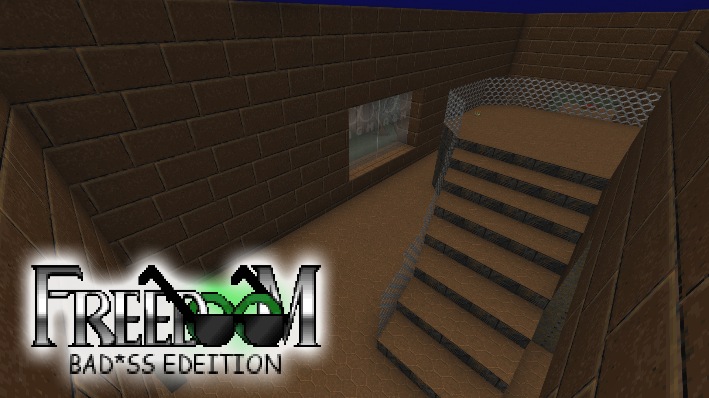
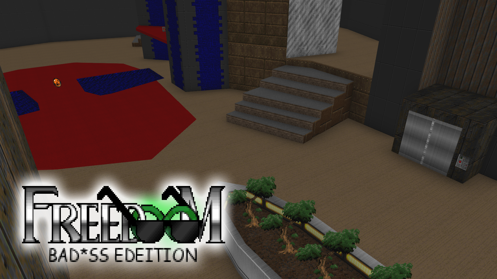
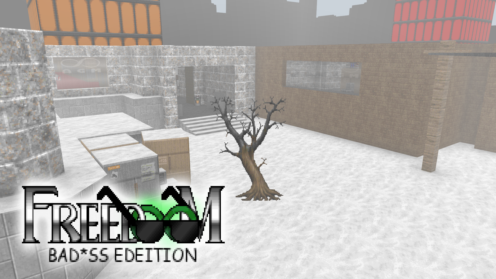

# 

the single most bad*ss freedoom mod to ever hit the internet

features:

* sheer bad*ssery
* a wide arsenal of bad*ss weapons
* a bad*ss mappack made just for the mod with over 20 brand new levels
* two new player classes
* a bad*ss storyline
* cocaine

[official discord](https://discord.gg/Rb6DyWyNXV)

[official website](https://freedoom-badass-edition.github.io/)

# installing and launching the mod

see [installing and launching the mod](https://github.com/freedoom-badass-edition/freedoom-badass-edition/wiki/installing-and-launching-the-mod) on the wiki

# screenshots

# faq

#### what in the ass is this

an overly ambitious stupid joke wad for freedoom

#### update when?

when anyone in the team feels like doing so, or you can update it yourself if you have the proper skills

#### i would like to contribute to the project pretty please

go right ahead, [fork the project](https://github.com/freedoom-badass-edition/freedoom-badass-edition/fork), make some changes and make a pull request!

you can also [join our discord](https://discord.gg/Rb6DyWyNXV) if you want to get in contact with most of the team

if you want to contribute to the mappack, check the [CREDITS file](CREDITS) to check for any open map slots

#### what should I do if I spot an unusual and possibly game breaking bug, or just want you guys to add something?

you can just [send an issue](https://github.com/freedoom-badass-edition/freedoom-badass-edition/issues/new/choose) to our [github issues page](https://github.com/freedoom-badass-edition/freedoom-badass-edition/issues)

#### how do I play multiplayer?

[check the zdoom wiki article about multiplayer](https://zdoom.org/wiki/Multiplayer) for the basic stuff

the multiplayer is possible on lan and online if you're willing to go through the pain of port forwarding, but even then zdoom's sloppy netcode will give you a headache when playing with more than 2 players or with your homeboy in somalia or serbia

if you need any help or want to find someone willing to play you can check out [our discord](https://discord.gg/Rb6DyWyNXV)

#### is zandronum ever going to be supported?

no, unless they catch up to the 2549 commits and add zscript support. in the meantime you still can play bad*ss deathmatch on your local network using uzdoom or lzdoom (check the question right above this)

#### which iwads does this support?

the generally recommended experience is playing the mod through the latest freedoom phase 2 iwad

phase 1 and the official id software doom iwads are not supported and will not be a pleasant experience due to missing textures and sounds

other iwads like strife, hexen, heretic, etc., are **DEFINITELY** not supported, and you **will** have a very busted and janky experience

#### i have no money for freedoom

what

#### this is too bad*ss for me

too bad(*ss)

# sourceport compatibility

* uzdoom v4.14: perfect
* gzdoom v4.14: perfect
* gzdoom v4.13: perfect
* lzdoom v3.88: alright but it's missing localized text
* questzdoom: alright but in vr
* zandronum: doesn't work (no zscript)
* zdoom: doesn't work (dinosaur)
* anything non-uzdoom based: doesn't work
* your toaster in the kitchen: only works on friday the 13th during a solar eclipse

# quotes

> "Gapisz mi się na bebech?" - Rafał Walentowicz narrating Philadelphia Charlemagne "Phil" Collins III's translated dialogue

> "Fuck this I'm making a weapon pack for freedoom on my dead gpu for no particular reason" - Saver310

> "Oops I accidentally created freedoom badass edition" - Saver310

> "I'm gonna kill myself how do I change this" - Saver310

> "What the fuck is even going on" - Saver310

> "What the fuck is happening" - Saver310

> "I think I'm gonna cave in my skull with a coconut and fall asleep due to head trauma" - Saver310

> "Please for fucks sake somebody update the mod" - Saver310

> "we're so back I inserted 5 words into readme" - Saver310

> "I swear to god if my computer breaks for the 6th time I'm gonna shoot myself with a 12gauge" - Saver310

> "This fucking sucks my shit through a straw" - Saver310

> "Ball acid dipping" - Saver310

> "Ssie dupsko" - Saver310

> "Yeah hotter like haha you sex ha women spicy mama mia gifs internet videos" - Saver310

> "Also I think I should throw a large brick at someone" - Saver310

> "I was gonna update FD:B*E Until I got high" - Saver310

> "I'm gonna change myself, how do I kill this" - rostuhan

> "Imagine if Freedoom: Bad*ss Edition had a water gun that broke balls" - rostuhan

> "Bad*ss life support" - rostuhan

> "Having a broken GPU with glitched out colours is the intended way to play" - rostuhan

> "WHITOID SPOTTED" - SmekkyBoy

> "get this NERD out of my sight.... doesnt know who David William is..." - SmekkyBoy

> "human rights REVOKED!!!!!" - SmekkyBoy

> "Whoever fucking changed my username will know the wrath of gods employers if i find them" - SmekkyBoy

> "ill start working on map31 soon (when I feel like it)" - Xiaojun Yue (Dari)

> "i've had my job STOLEN i will be working on badass27 now if i feel like it" - Xiaojun Yue (Dari)

> "Evil scary dillar 💀💀💀" - Morris

> "why" - CMOS555

> "Oops" - Everyone after a pull request is pushed to the main branch and it breaks everything

# our benefactors

these are some other cool projects you should check out if you haven't!

[Freedoom](https://github.com/freedoom/freedoom) is a replacement iwad for the doom engine, and the whole project was based and built specifically for it

[Biff Fraggar](https://github.com/SmekkyBoy/Biff-Fraggar) is a cool little standalone libre and foss game on the doom engine, created by some of our contributors

[SLADE](https://slade.mancubus.net/index.php), it's a doom editor and it is truly bad*ss

[UZDoom](https://github.com/UZDoom/UZDoom) is a way better version of unoptimized but powerful spawn of hell, which powers our mod, [that doesn't use ChatGPT](https://github.com/ZDoom/gzdoom/issues/3395)

[Aseprite](https://www.aseprite.org/) is one of the best pixel art programs I've ever used - Saver310

[Inkscape](https://inkscape.org/) is a solid vector graphics editor, and I've used it to create the CREDITS texture - Saver310

[GIMP](https://www.gimp.org/) is kickass - Saver310
