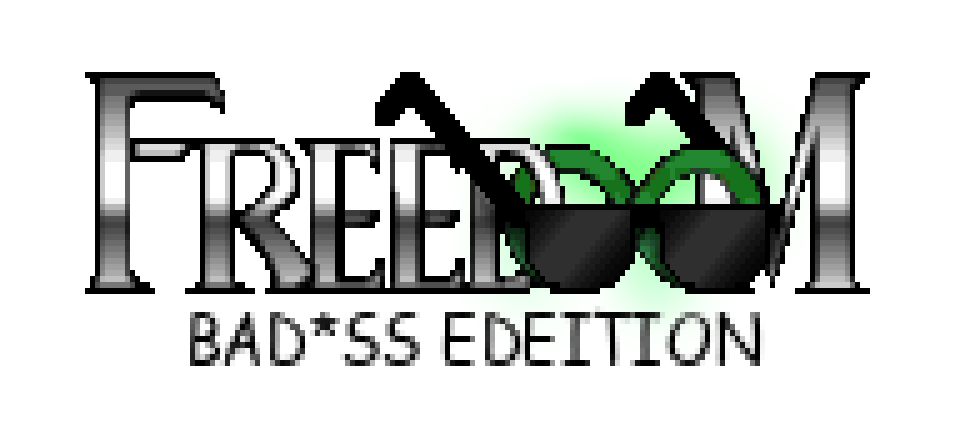
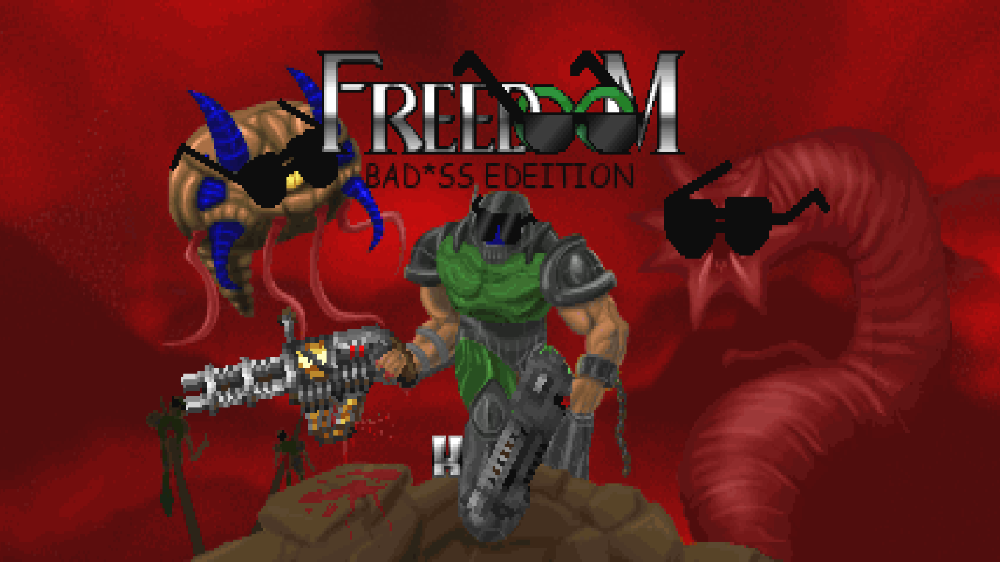
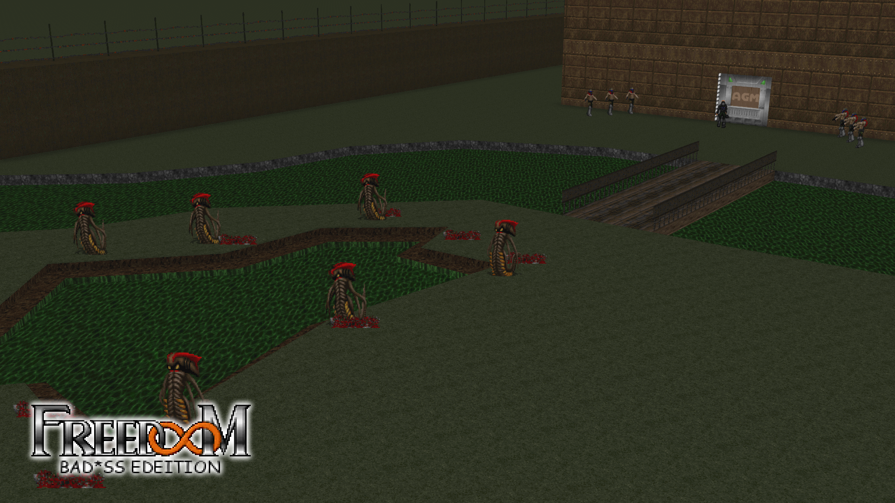
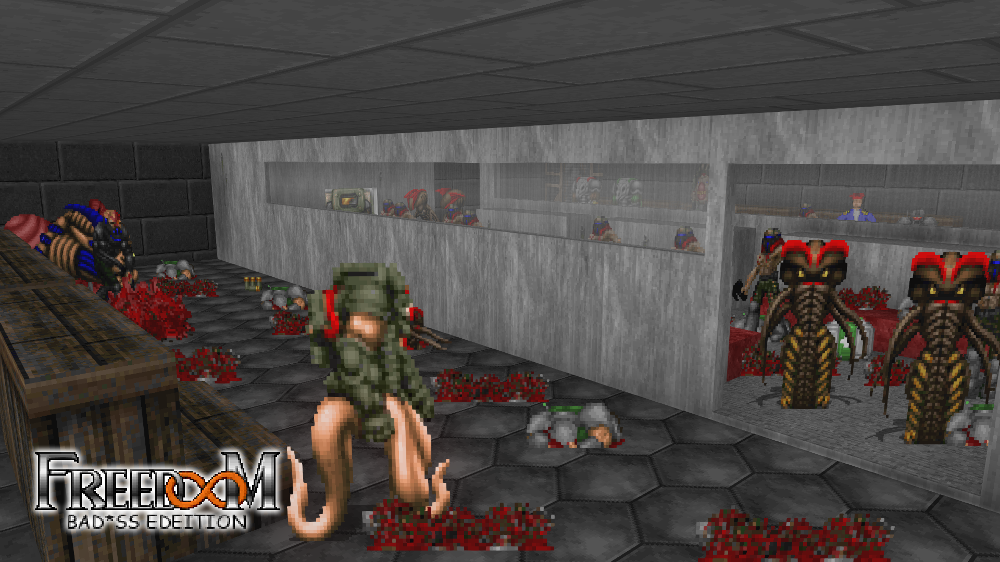
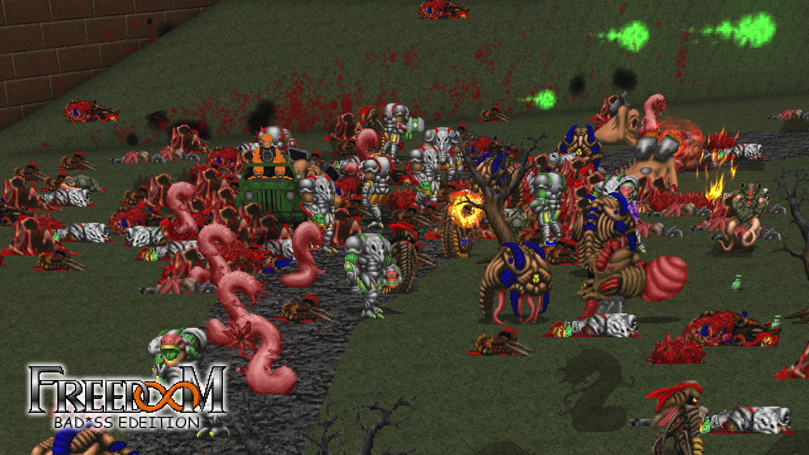
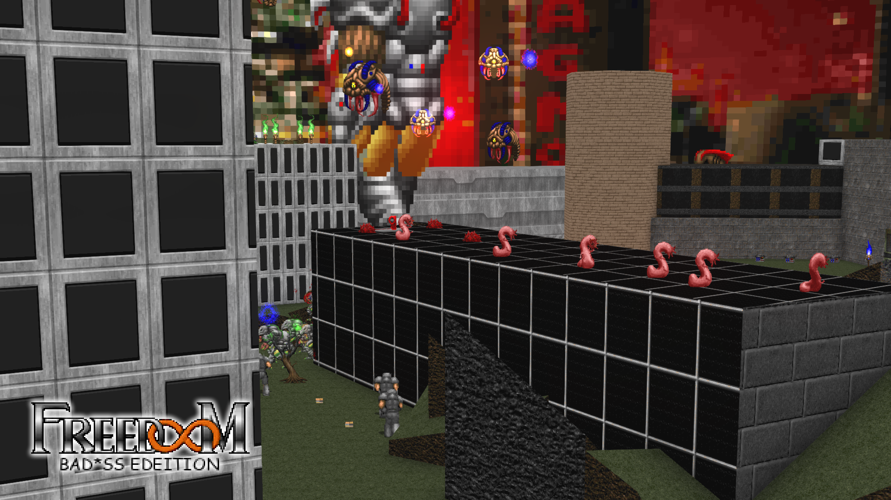
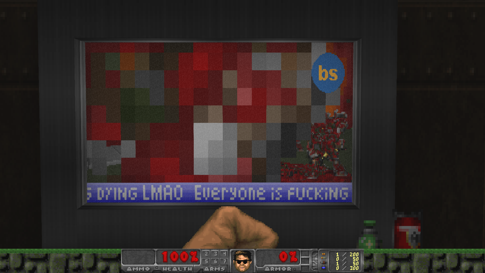
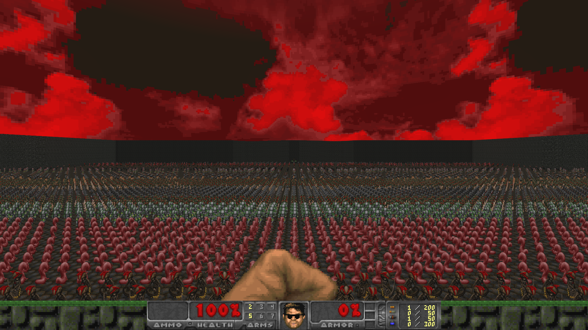

# 

the most bad*ss freedoom mod on earth made for uzdoom

features:
* bad*ssery
* a wide arsenal of bad*ss weapons
* bad*ss mappack made just for the mod with 20 brand new levels
* two new player classes
* bad*ss storyline
* cocaine

[official discord](https://discord.gg/Rb6DyWyNXV)

[official website](https://freedoom-badass-edition.github.io/)

# screenshots

# installing and launching the mod

### prerequisites

- functioning brain
- a pulse
- supported hardware that runs your desired and supported sourceport
- any supported sourceport (see "sourceport compatibility")
- freedoom phase 2 iwad
- `git` for the turbo nerd way

### instructions

#### the nice and quick way

works like a charm and isn't a pain

this is the recommended method although you won't be able to do funky git stuff

1. click on "Code"

2. click "Download ZIP"

3. drag and drop the downloaded file into your sourceport of choice or use a launcher

4. enjoy (optional)

#### the turbo nerd way

if you have some knowledge of git and/or you're a linux user this is the best option

1. open your terminal of choice

2. write `git clone https://github.com/freedoom-badass-edition/freedoom-badass-edition.git` and press enter

3. type in the name of the executable of your sourceport and `freedoom-badass-edition` following it (`uzdoom freedoom-badass-edition` for example)

4. enjoy (optional)

#### the stable way

this is the most stable out of the other ones but isn't the latest

it is generally advised that you use the other methods

1. click on "Releases"

2. click "Source code"

3. drag and drop the downloaded file into your sourceport of choice or use a launcher

4. enjoy (optional)

if you encounter problems you can contact the fine people at our [discord](https://discord.gg/Rb6DyWyNXV)

# faq

#### what in the ass is this

an overly ambitious stupid joke wad for freedoom

#### update when?

when anyone in the team feels like doing so, or you can update it yourself if you have the proper skills and making a pull request

#### i would like to contribute to the project pretty please

go right ahead, fork the project, make some changes and make a pull request!

you can also join our [discord](https://discord.gg/Rb6DyWyNXV) if you want to get in contact with most of the team

if you want to contribute to the mappack, check the CREDITS file included for any open map slots

#### what should I do if I spot an unusual and possibly game breaking bug, or just want you guys to add something?

you can just send an issue to our github page

#### how do I play multiplayer?

[check the zdoom wiki article about multiplayer](https://zdoom.org/wiki/Multiplayer) for the basic stuff

the multiplayer is sadly only possible on lan, unless you're willing to go through doxxing yourself and port forwarding, but even then zdoom's sloppy netcode will give you a headache when playing with more than 2 players or with your homeboy in somalia or serbia

if you need any help or want to find someone willing to play you can check out our [discord](https://discord.gg/Rb6DyWyNXV)

#### is zandronum going to be supported?

no, unless they catch up to the 2549 commits and add zscript support. in the meantime you still can play bad*ss deathmatch on your local network using gzdoom or lzdoom (check the question right above this)

#### can I play on other iwads?

the generally recommended experience is playing the mod through freedoom phase 2

phase 1 and the official id software doom iwads are not supported and will not be a pleasant experience due to missing textures and sounds

other iwads like strife, hexen, heretic, etc., are **DEFINITELY** not supported, and you **will** have a very busted and janky experience

#### i have no money for freedoom

what

#### this is too bad*ss for me

too bad

# sourceport compatibility

* gzdoom v4.13: perfect
* gzdoom v4.14: perfect
* uzdoom v4.14: perfect
* lzdoom v3.88: alright but it's missing localized text
* questzdoom: alright but in vr
* qzdoom: untested but might work
* zandronum: doesn't work (no zscript)
* zdoom: doesn't work (dinosaur)
* anything non-gzdoom/lzdoom based: doesn't work (it's built on gzdoom dum dum)
* your toaster in the kitchen: only works on friday the 13th during a solar eclipse

# quotes

> "Gapisz mi się na bebech?" - Rafał Walentowicz narrating Philadelphia Charlemagne "Phil" Collins III's translated dialogue

> "Fuck this I'm making a weapon pack for freedoom on my dead gpu for no particular reason" - Saver310

> "Oops I accidentally created freedoom badass edition" - Saver310

> "I'm gonna kill myself how do I change this" - Saver310

> "What the fuck is even going on" - Saver310

> "What the fuck is happening" - Saver310

> "I think I'm gonna cave in my skull with a coconut and fall asleep due to head trauma" - Saver310

> "Please for fucks sake somebody update the mod" - Saver310

> "we're so back I inserted 5 words into readme" - Saver310

> "I swear to god if my computer breaks for the 6th time I'm gonna shoot myself with a 12gauge" - Saver310

> "I'm gonna change myself, how do I kill this" - rostuhan

> "Imagine if Freedoom: Bad*ss Edition had a water gun that broke balls" - rostuhan

> "Bad*ss life support" - rostuhan

> "WHITOID SPOTTED" - SmekkyBoy

> "get this NERD out of my sight.... doesnt know who David William is..." - SmekkyBoy

> "human rights REVOKED!!!!!" - SmekkyBoy

> "ill start working on map31 soon (when I feel like it)" - Xiaojun Yue (Dari)

> "i've had my job STOLEN i will be working on badass27 now if i feel like it" - Xiaojun Yue (Dari)

> "why" - CMOS555

> "Oops" - Everyone after a pull request is pushed to the main branch and it breaks everything

# our benefactors

these are some other cool projects you should check out if you haven't!

[Freedoom](https://github.com/freedoom/freedoom) is a replacement iwad for the doom engine, and the whole project was based and built specifically for it

[Biff Fraggar](https://github.com/SmekkyBoy/Biff-Fraggar) is a cool little standalone libre and foss game on the doom engine, created by some of our contributors

[SLADE](https://slade.mancubus.net/index.php), it's a doom editor and it is truly bad*ss

[UZDoom](https://github.com/UZDoom/UZDoom) is a way better version of unoptimized but powerful spawn of hell, which powers our mod, [that doesn't use ChatGPT](https://github.com/ZDoom/gzdoom/issues/3395)
